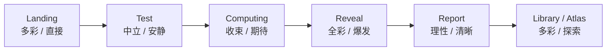

# AIdeology — Ideological Neo‑Brutalism Design System v1.0
## 意识形态新野兽派设计系统

> 项目：AIdeology / AI 意识形态测试  
> 目标用户：以 B 站为核心的年轻互联网用户、AI 兴趣用户、科技 / 社会议题 / 亚文化用户  
> 文档用途：OpenDesign、Figma、前端开发、ChatGPT / Claude / Codex / Cursor 等 AI 设计与开发工具统一视觉规范  
> 版本：v1.0  
> 核心风格：**Ideological Neo‑Brutalism / 意识形态新野兽派**

---

# 0. 一句话结论

AIdeology 不应该长得像一个冷静、白色、标准化的 AI SaaS 网站。

它应该是：

> **未来思想游乐场 × 数字宣言展览 × 世界观实验系统。**

视觉核心不是“科技感”，而是：

> **不同思想、不同价值、不同未来正在碰撞。**

因此采用：

# Ideological Neo‑Brutalism
# 意识形态新野兽派

以 Neo‑Brutalist 的：

- 黑色硬边框
- 直角结构
- 硬边阴影
- 高对比色
- 巨型字体
- 强烈按钮反馈
- 海报式构图

作为视觉骨架，再加入 AIdeology 独有的：

- 26 种主义色彩系统
- 12 条价值轴
- 宣言式排版
- 编号 / 参数 / 坐标
- 意识形态冲突
- 测试中立机制
- 多页面视觉强度控制

最终形成：

> **结构直接、思想鲜明、年轻、好玩、可传播，同时保留严肃议题与思想深度。**

---

# 1. 为什么 AIdeology 适合 Neo‑Brutalism

传统未来科技网站往往使用：

- 白色大留白
- 蓝紫渐变
- 玻璃拟态
- 发光球
- 柔和阴影
- 极简 SaaS 组件

这些视觉已经高度同质化。

AIdeology 的核心不是“AI 工具”，而是：

- AI 应该加速还是暂停？
- AI 应该属于资本还是公共社会？
- 算法是否应该拥有治理权？
- AI 是否可能成为生命？
- 人类应该保持中心地位还是进入多智能共生？
- 国家应该合作还是进入军备竞赛？

因此 AIdeology 需要的是：

> **冲突、表达、身份、探索、碰撞。**

Neo‑Brutalism 天生具有：

- 鲜明立场感
- 强视觉记忆
- 青年文化感
- 反标准模板感
- 海报感
- 互联网原生感
- 易形成截图传播

这与 B 站年轻用户非常匹配。

---

# 2. 品牌定位

AIdeology 不是：

- 政治考试
- 学术问卷
- AI SaaS 工具
- 严肃研究报告
- MBTI 换皮
- Cyberpunk 世界观站点

AIdeology 是：

> **一个让用户探索“自己希望 AI 世界变成什么样”的互动思想产品。**

品牌关键词：

- Bold
- Vivid
- Direct
- Playful
- Ideological
- Experimental
- Computational
- Manifesto-like
- Youthful
- Pluralistic
- Future-facing

中文关键词：

- 鲜明
- 直接
- 有趣
- 活力
- 思想碰撞
- 数字系统
- 宣言感
- 多元立场
- 未来想象
- 青年表达

---

# 3. 核心设计哲学

## 3.1 Structure Neutral, Ideology Expressive

### 结构中立，思想鲜明

系统结构必须稳定：

- 字体体系
- 栅格
- 间距
- 响应式
- 可读性
- 测试交互
- 信息层级

思想内容可以非常鲜明：

- 高纯度色彩
- 巨型标题
- 大编号
- 强对比
- 非对称排版
- 宣言
- 几何冲突
- 动态反馈

## 3.2 Color Is Position

### 颜色不是装饰，而是立场

AIdeology 中的颜色不只是美术装饰。颜色代表：

- 思想派别
- 世界观倾向
- 价值冲突
- 结果身份

用户应该逐渐建立：

> “看到这个颜色，就想到这种未来。”

因此：

- 测试过程中隐藏主义色
- 结果揭晓时释放主义色
- 图鉴中充分使用主义色
- Atlas 中颜色承担节点身份

## 3.3 Poster Before Dashboard

### 先做宣言海报，再做数据报告

结果页第一屏必须像：

> **一张属于用户的数字思想海报**

而不是：

> 成绩单 / 后台 Dashboard / 数据分析面板。

用户首先得到：

- 身份
- 情绪
- 记忆点
- 可分享画面

之后才进入：

- 价值轴
- 相近主义
- 冲突主义
- 详细解释

## 3.4 Raw ≠ Ugly

### 粗粝不等于粗糙

经典 Neo‑Brutalism 有意追求原始、直接、不圆滑。

AIdeology 不应该做成：

- 随便
- 低完成度
- 业余
- 难读
- 故意丑

我们追求：

> **精确设计出来的“直接感”。**

也就是：

**Designed Rawness / 有设计的粗粝感**

---

# 4. 页面视觉强度系统

不同页面不能一刀切。

| 页面 | Neo‑Brutalist 强度 | 色彩强度 | 目标 |
|---|---:|---:|---|
| Landing 首页 | 75% | 高 | 吸引、建立品牌 |
| Test 做题页 | 30% | 低 | 中立、专注、可读 |
| Computing 计算页 | 50% | 中 | 收束、制造期待 |
| Result 结果页 | 90% | 极高 | 身份揭晓、传播 |
| Library 图鉴页 | 85% | 极高 | 探索、收藏、传播 |
| Detail 主义详情 | 75% | 高 | 阅读 + 宣言 |
| Atlas 谱系 | 60% | 中高 | 系统感、探索 |

核心体验曲线：



---

# 5. Neo‑Brutalist 基础规则

## 5.1 边框

标准：

```text
Primary Border:
2px mobile
3px desktop

Hero / Key Poster Border:
3px mobile
4px desktop
```

颜色：

```text
#000000
```

原则：

- 核心交互元素优先使用纯黑边框
- 不使用灰色模拟黑边框
- 普通信息分隔线可以使用浅灰
- 测试页为了降低视觉压力，可减少边框数量

## 5.2 圆角

默认：

```text
0px
```

允许例外：

- 搜索输入框：0–4px
- 系统级 Tooltip：0–4px
- Accessibility 控件：0–4px
- 装饰圆形元素可以使用圆形
- 头像等天然圆形资产不受限制

禁止：

- 大量 12 / 16 / 24px SaaS 圆角
- 所有卡片统一圆角
- 胶囊 UI 泛滥

## 5.3 硬阴影

标准：

```css
box-shadow: 4px 4px 0 #000;
```

Desktop 强调：

```css
box-shadow: 6px 6px 0 #000;
```

Hero / 强 CTA：

```css
box-shadow: 8px 8px 0 #000;
```

阴影必须：

- 无 blur
- 无 soft shadow
- 无 ambient shadow
- 与组件产生明显实体关系

---

# 6. 交互物理感

Neo‑Brutalism 的按钮要像实体。

## Default

```text
Border + Hard Shadow
```

## Hover

- 向左上移动 2–4px
- 阴影增加
- 背景色硬切换
- 不使用透明淡入

## Active

- 元素压向右下
- 阴影消失
- 位移量应接近原阴影距离

示意：

```css
.button {
  border: 3px solid #000;
  box-shadow: 6px 6px 0 #000;
}

.button:hover {
  transform: translate(-2px, -2px);
  box-shadow: 8px 8px 0 #000;
}

.button:active {
  transform: translate(6px, 6px);
  box-shadow: none;
}
```

动画：

```text
100–180ms
ease-out
```

不要使用：

- 400ms 柔和动画
- spring 过度弹性
- opacity fade 做核心反馈

---

# 7. 色彩系统

## 7.1 Base Colors

```text
Ink Black      #0A0A0A
Pure Black     #000000
Pure White     #FFFFFF
Paper White    #F7F7F2
Cool Surface   #F2F4F7
Muted Text     #65717E
```

## 7.2 System Accent

测试阶段使用统一系统色。

建议：

```text
System Blue    #3975FF
System Yellow  #FFD600
```

这两个颜色：

- 不对应单一意识形态
- 只用于系统状态
- 不作为答题价值暗示

## 7.3 Ideology Colors

每个主义拥有独立主色。

核心原则：

> 主义色可以大面积使用，不局限于按钮或图标。

典型：

```text
Acceleration   #FF3B30
Pause          #FFD000
Transhuman     #8E36E8
Digital Life   #E23B91
Commons        #00AFC7
Open           #00A994
Sovereign      #173FAE
Arms Race      #D51F26
Post-Work      #B7F13A
```

结果页可以：

> 60–90% 页面第一屏由主义色统治。

---

# 8. 配色原则

## 推荐组合

### Pattern A
```text
Black + White + 1 Ideology Color
```

### Pattern B
```text
Black + White + 2 Opposing Ideology Colors
```

### Pattern C
```text
Black + 3–5 Ideology Colors
```

仅用于：

- Landing
- Library
- Atlas

避免：

> 26 种颜色在同一视觉区域平均出现。

多彩不等于彩虹。

---

# 9. 字体系统

## 9.1 中文主字体

优先：

- MiSans
- HarmonyOS Sans SC
- 思源黑体
- 阿里巴巴普惠体

## 9.2 英文主字体

- Inter
- Geist
- Space Grotesk

## 9.3 Mono

推荐：

- JetBrains Mono
- Geist Mono
- IBM Plex Mono

仅用于：

```text
IDEOLOGY_17
MATCH 84.7
SCENARIO_014
VECTOR_06
AXIS_D08
QUESTION 14 / 36
```

重要：

> **不要照搬传统 Neo‑Brutalism，把所有正文都设为 Mono。**

中文长文使用现代 Sans。

---

# 10. Typography

标题允许非常大胆。

Desktop：

```text
Hero Chinese: 72–128px
Page Title: 48–80px
Card Poster Title: 28–52px
Body: 16–20px
Mono Label: 11–14px
```

Mobile：

```text
Hero: 44–72px
Page Title: 32–48px
Body: 15–18px
```

标题：

```text
font-weight: 800–950
tracking: tight
```

可以：

- 破框
- 换行夸张
- 单词独立成行
- 超大数字
- 中英混排
- Vertical Label

---

# 11. Layout

## 11.1 不做传统 SaaS 卡片墙

减少：

- 四列一样高卡片
- 同样圆角
- 同样间距
- 同样阴影

增加：

- Masonry
- Asymmetric Grid
- Poster Block
- Full-width Block
- Oversized Section
- Split Layout
- Intentional Offset

## 11.2 网格

Desktop：

```text
12-column grid
max-width 1440–1600px
```

允许：

- 元素跨 5 / 7 列
- 主义卡跨 2×高度
- 部分视觉出格
- 标题覆盖 Grid

但：

> 信息结构必须仍然清晰。

---

# 12. 图形语言

AIdeology 不依赖插画也必须成立。

允许：

- 方块
- 圆
- 三角
- 黑线
- 箭头
- 分区
- 坐标
- 节点
- 路径
- 网格
- 数字
- 大色面
- CSS Pattern

优先：

> 简单形状 + 高辨识构图。

避免：

- 复杂 3D 科幻球
- 通用 AI 大脑
- 电路板插画
- 蓝紫发光神经网络
- Web3 光晕

---

# 13. Landing 首页

## 设计目标

第一眼告诉用户：

> **这里有 26 种关于 AI 未来的立场。**

而不是：

> 这是一个 AI 测试网站。

## 视觉强度

```text
Neo-Brutalism: 75%
Color: High
Motion: Medium
```

## Hero 建议

大型标题：

```text
AI
不只是
工具。
```

或：

```text
当 AI 不再只是工具，
你站在哪一边？
```

旁边用高对比标签：

```text
26 POSSIBLE FUTURES
```

右侧建立：

### Ideology Conflict Field

使用：

- 红色 ACCELERATE
- 黄色 PAUSE
- 青色 COMMONS
- 绿色 OPEN
- 蓝色 CONTROL
- 紫色 DIGITAL LIFE

各自成为有黑框的色块。

允许轻微挤压、错位、碰撞。

---

# 14. Test 做题页

## 核心原则

> **Quiet Brutalism / 安静野兽派**

绝对不能让风格干扰答题。

## Visual Strength

```text
Neo-Brutalism: 25–35%
Color: Very Low
Motion: Low
```

## Test 使用

- Paper White
- Black
- Cool Gray
- System Blue

禁止：

- 主义主色
- 主义图标
- 强视觉隐喻
- 情绪色彩
- 红 / 绿暗示对错

## 答案卡

默认：

```text
White
2px Black Border
No Radius
No Shadow or 2px Shadow
```

Hover：

```text
slight translation
hard border emphasis
```

Selected：

```text
Black background
White text
```

或者：

```text
System Blue background
Black border
```

---

# 15. Computing 计算页

任务：

> 从中立测试世界，过渡到意识形态世界。

可以显示：

```text
01 ANALYZE VECTOR
02 NORMALIZE AXES
03 MATCH IDEOLOGIES
04 FIND RESONANCE
05 BUILD WORLDVIEW
```

视觉：

- 开始只有黑白
- 逐渐出现少量结果色
- 最后进入 Reveal

---

# 16. Result 结果页

这是整个产品视觉最重要的页面。

Visual Strength：

```text
Neo-Brutalism: 90%
Color: Maximum
Motion: High
```

## Result Hero

必须包含：

```text
IDEOLOGY_17
MATCH 84.7

智能公共主义
INTELLIGENCE COMMONS
```

主义色：

```text
#00AFC7
```

巨型：

```text
17
```

宣言：

```text
INTELLIGENCE
BELONGS
TO EVERYONE.
```

或中文：

```text
智能不是奢侈品，
而是文明基础设施。
```

## Result Hero 禁止

不要：

- 结果像考试成绩
- 排名前三直接摆首页
- 雷达图占据 Hero
- 一屏塞太多解释
- 过早进入 Dashboard

第一屏只解决：

> 我是谁？

---

# 17. Library 图鉴页

视觉定义：

> **26 Future Ideology Posters**

不是：

> Card Library

每张主义卡必须有：

```text
ID
中文主义名
English Name
一句话宣言
Primary Color
几何构图
```

例如：

```text
IDEOLOGY_04

AI 暂停主义

STOP.
VERIFY.
THEN PROCEED.
```

## 图鉴布局

推荐：

```text
Asymmetric Masonry
```

允许：

- Tall Poster
- Wide Poster
- Square Poster
- Small Tile
- Feature Poster

从而让页面像：

> 海报展览墙。

---

# 18. Atlas 谱系

风格：

> Scientific Brutalism

背景可深色或浅色。

节点：

- 黑色外框
- 主义色填充
- ID
- 短名称

Hover：

- 变大
- 弹出硬边 Tooltip
- 显示三关键词

Selected：

- 当前节点 100%
- 邻居 60%
- 其他 15–25%

---

# 19. 动效语言

Neo‑Brutalist 动效不应该柔软。

关键词：

- Snap
- Shift
- Crush
- Slide
- Block
- Wipe
- Stamp
- Collision

## 推荐

### Button

```text
Hover → lift
Active → crush
```

### Poster

```text
Hover → 2–4px tilt / shift
```

### Result Reveal

```text
Color block wipes
ID stamps in
Manifesto enters by block
```

### Library

```text
Hard snap filtering
```

## 不推荐

- 玻璃 dissolve
- soft fade everywhere
- floating bubble
- slow aurora
- excessive parallax

---

# 20. 图标

优先：

- 线性系统图标
- 简单几何图标
- Unicode / Typography symbol

如：

```text
+
×
→
↗
∞
●
■
```

图标不承担意识形态身份。

---

# 21. Mobile

移动端不是 PC 缩小版。

保持：

- 大标题
- 黑框
- 色块
- 物理按钮感

减少：

- Masonry 复杂度
- 装饰节点
- 横向文字
- 巨大硬阴影

建议：

```text
Desktop Shadow 6–8px
Mobile Shadow 3–4px
```

---

# 22. Accessibility

必须：

- 文本达到 WCAG AA
- 不用颜色单独表达状态
- Selected 同时有边框 / 图标 / 文本变化
- Focus 清晰
- Keyboard accessible
- prefers-reduced-motion 支持

尤其测试页面：

> 可读性永远优先于风格。

---

# 23. 绝对禁止

## 风格禁止

- 大面积蓝紫渐变
- Aurora Gradient
- Mesh Gradient
- Glassmorphism
- Frosted Glass
- 柔和 SaaS Shadow
- 16–32px 大圆角
- 所有卡片统一白色
- 所有区域统一 Grid Card
- AI 发光球
- AI 大脑插画
- Cyberpunk Neon
- Web3 风
- 复古纸张
- 学术论文风
- 咨询公司报告风

## 产品禁止

- 测试题提前暴露主义颜色
- 红 / 绿暗示答案正确错误
- 选项视觉权重不一致
- 结果页第一屏像数据后台
- 图鉴 26 张卡完全相同
- 通过装饰牺牲中文可读性

---

# 24. AIdeology Hard Prompt
## 可直接复制给 OpenDesign / Claude / Codex / Cursor

```text
STYLE_REFERENCE
style_name: Ideological Neo-Brutalism
style_name_cn: 意识形态新野兽派
project: AIdeology / AI意识形态测试

请严格遵守以下风格规则，不要风格漂移。

# Product

AIdeology 是一个面向年轻互联网用户的 AI 意识形态测试与未来思想探索产品。

核心主题包括：
AI、权力、劳动、自由、人类、风险、技术进步、社会制度、世界秩序、未来文明。

产品不是传统政治测试，也不是 AI SaaS。

它应该像：
未来思想游乐场 × 数字宣言展览 × 世界观实验系统。

# Core Philosophy

STRUCTURE NEUTRAL, IDEOLOGY EXPRESSIVE.

结构保持清晰、稳定、可读；
思想内容通过鲜明色彩、大字、几何构图、编号和宣言形成强烈身份。

# Visual Style

使用 Ideological Neo-Brutalism：

- 纯黑硬边框
- 基本无圆角
- 硬边缘阴影
- 高对比纯色
- 巨型标题
- 超大编号
- 海报式排版
- 非对称网格
- Mono 参数标签
- 强烈的实体按钮反馈
- 简单几何
- 坐标、节点、网格、Axis、Vector、ID

整体要：

bold
vivid
direct
playful
ideological
experimental
computational
manifesto-like
youthful
pluralistic

# Borders

核心卡片 / 按钮：
mobile: 2px solid black
desktop: 3–4px solid black

不得使用灰色模拟粗边框。

# Radius

默认 0px。

禁止大量：
rounded-lg
rounded-xl
rounded-2xl
rounded-3xl

只有系统级小控件允许 2–4px。

# Shadow

只使用 hard shadow。

推荐：
4px 4px 0 #000
6px 6px 0 #000
8px 8px 0 #000

禁止：
blur shadow
ambient shadow
soft SaaS shadow

# Interaction

Hover:
- 100–180ms
- ease-out
- 元素向左上移动 2–4px
- 硬阴影增大
- 颜色直接切换

Active:
- 元素向右下压
- shadow 消失
- 形成 Physical Crushing 实体压下感

禁止用慢速 opacity fade 作为核心反馈。

# Typography

中文正文：
MiSans / HarmonyOS Sans SC / Source Han Sans

英文：
Inter / Geist / Space Grotesk

Mono 只用于：
IDEOLOGY_17
MATCH 84.7
SCENARIO_014
AXIS_D08
VECTOR_06

禁止中文长正文全部使用 monospace。

标题使用：
font-weight 800–950
tight tracking

允许超大字号和中英混排。

# Color

Base:
#000000
#0A0A0A
#FFFFFF
#F7F7F2
#F2F4F7

测试系统色：
#3975FF
#FFD600

不同意识形态拥有独立高纯度主色。
主义色允许成为整个页面的大面积背景，不要只用于 icon 或 badge。

# Layout

禁止普通 SaaS 卡片墙。

优先：
asymmetric grid
masonry
poster layout
split layout
oversized typography
full-width color block
intentional offset

# Graphic Language

优先使用：
line
square
circle
triangle
arrow
node
grid
axis
vector
path
block
number

不要依赖角色或插画。

# Page Intensity

Landing:
Neo-Brutalist 75%
多彩、鲜活、思想碰撞。

Test:
Neo-Brutalist 30%
Quiet Brutalism。
必须中立、安静、可读。
禁止主义色、主义名称、价值暗示。

Computing:
50%
黑白逐渐过渡到结果色。

Result:
90%
必须像数字宣言海报。
第一屏优先身份与宣言，不做 Dashboard。

Library:
85%
26 个主义 = 26 张思想海报。
使用 asymmetric masonry。
卡片构图必须存在差异。

Atlas:
60%
像未来思想参数空间。

# Test Neutrality

测试页禁止：
- ideology color
- ideology icon
- red = danger
- green = good
- visual emphasis differences between answers

所有选项视觉权重必须一致。

# Result Hero

必须体现：
IDEOLOGY_ID
MATCH
中文主义名
English Name
Manifesto

结果第一屏必须具有可截图传播性。

# Absolute Prohibitions

禁止：
- blue-purple generic AI gradient
- glassmorphism
- aurora
- mesh gradient
- neon cyberpunk
- Web3 look
- glowing AI orb
- soft SaaS shadow
- large rounded cards everywhere
- consulting dashboard
- retro paper texture
- generic AI brain illustration

# Final Self Check

生成前检查：
1. 是否一眼可以识别为 Neo-Brutalist？
2. 是否仍然像正式产品，而不是海报拼贴？
3. 是否具有 AIdeology 独特的思想色彩系统？
4. 是否避免通用 AI SaaS 风？
5. 测试页是否绝对中立？
6. Result 是否具有身份揭晓感？
7. Library 是否像思想海报展？
8. 中文可读性是否良好？
9. Mobile 是否保持风格但降低视觉重量？
10. 是否存在风格漂移？
```

---

# 25. Landing 专用 Prompt

```text
使用 AIdeology — Ideological Neo-Brutalism 设计系统设计 Landing 首页。

视觉强度：Neo-Brutalist 75%。

目标：让年轻用户第一眼产生：
“这是什么？好像挺有意思，我想测一下。”

Hero 主标题：
当 AI 不再只是工具，
你站在哪一边？

或：
AI
不只是
工具。

加入：
26 POSSIBLE FUTURES

CTA：
开始测试
探索意识形态谱系

右侧不要放传统 AI 插画。

建立 Ideology Conflict Field：
ACCELERATE
PAUSE
COMMONS
HUMAN FIRST
DIGITAL LIFE
OPEN
CONTROL

这些词分别位于高饱和色块中。

使用：
黑色粗边框
硬阴影
节点
箭头
轴线
错位色块
巨型文字

避免：
SaaS Hero
蓝紫渐变
3D AI 大脑
发光球

首页应该像：
未来思想展览入口。
```

---

# 26. Test 专用 Prompt

```text
使用 AIdeology — Quiet Brutalism 设计测试页。

Neo-Brutalist 强度仅 30%。
这是严肃测试阶段，视觉必须中立。

禁止：
- 任何主义色
- 主义名称
- 主义符号
- 红绿暗示
- 强烈海报构图

配色：
#F7F7F2
#FFFFFF
#000000
#65717E
#3975FF

页面包含：
SCENARIO_014
QUESTION 14 / 36
进度条
题目
4 个答案
上一题
下一题
稍后回答

题目必须成为视觉中心。

答案：
白底
2px 黑框
0 圆角
视觉权重一致

Hover：
轻微硬阴影。

Selected：
黑底白字或系统蓝。

整体感觉：
Quiet
Focused
Neutral
Readable
Direct

像一座安静的“情景思考舞台”，而不是表单。
```

---

# 27. Result 专用 Prompt

```text
使用 AIdeology — Ideological Neo-Brutalism 设计结果页。

Neo-Brutalist 强度 90%。
这是 Identity Reveal。

示例结果：
IDEOLOGY_17
MATCH 84.7

智能公共主义
INTELLIGENCE COMMONS

Primary Color:
#00AFC7

第一屏使用大面积 #00AFC7 + 黑色。

必须出现：
巨型数字 17

Manifesto：
INTELLIGENCE
BELONGS
TO EVERYONE.

中文：
智能不是奢侈品，
而是文明基础设施。

使用：
黑色粗边框
硬阴影
大字号
巨型 ID
Axis
Node
Grid
Parameter
Black Label

第一屏不要放复杂雷达图。

第二屏再展示：
价值轴
相近主义
冲突主义
世界观摘要
分享按钮

最终视觉必须值得用户截图发 B 站动态、群聊或社交平台。
```

---

# 28. Library 专用 Prompt

```text
使用 AIdeology — Ideological Neo-Brutalism 设计 26 个主义图鉴。

视觉强度：85%。

图鉴不是普通 Card Grid。
它应该像：
26 张未来意识形态海报组成的数字展览。

布局使用：
Asymmetric Masonry。

允许：
竖海报
横海报
方形海报
小型 Tile
大型 Featured Poster

每个主义必须包含：
IDEOLOGY_ID
中文名
English Name
一句 Manifesto
Primary Color
几何构图

主义之间：
内容结构一致，
视觉构图不完全一致。

示例：

01 普罗米修斯加速主义
红色
上升 / 箭头 / 速度

04 AI暂停主义
黄色
阻断 / STOP / 横线

10 数字生命主义
粉紫
生成 / 圆 / 扩散

17 智能公共主义
青色
共享 / 多节点

26 军备竞速主义
红黑
对峙 / 双轨 / 竞争

页面必须让用户产生：
“我想一个个点进去看。”

不要设计成：
26 张一模一样的产品卡片。
```

---

# 29. Front-end Tailwind Rules

推荐 token：

```text
border:
border-2 md:border-[3px]
border-black

radius:
rounded-none

small shadow:
shadow-[3px_3px_0_#000]

medium shadow:
shadow-[4px_4px_0_#000]
md:shadow-[6px_6px_0_#000]

hero:
shadow-[6px_6px_0_#000]
md:shadow-[8px_8px_0_#000]

transition:
transition-all duration-150 ease-out
```

Button：

```text
hover:-translate-x-0.5
hover:-translate-y-0.5

active:translate-x-[6px]
active:translate-y-[6px]
active:shadow-none
```

注意：

> Active 位移必须和当前 shadow 距离协调。

---

# 30. 质检 Checklist

## Brand

- [ ] 第一眼不是普通 AI SaaS
- [ ] 有明显青年文化与互联网产品气质
- [ ] 有思想碰撞感
- [ ] 有 AIdeology 独有识别度

## Neo‑Brutalism

- [ ] 核心边框为纯黑
- [ ] 主要组件无大圆角
- [ ] 阴影是硬阴影
- [ ] 高对比色
- [ ] 标题足够大胆
- [ ] 按钮具有实体按压反馈

## AIdeology Adaptation

- [ ] 中文正文没有使用 Mono
- [ ] 测试页降低了风格强度
- [ ] 结果页放大了风格强度
- [ ] 主义色是系统，而非随机撞色
- [ ] 图鉴每种主义视觉不同

## Anti-Generic

- [ ] 没有 Aurora Gradient
- [ ] 没有 Glassmorphism
- [ ] 没有 AI Glowing Orb
- [ ] 没有通用 SaaS Card Grid
- [ ] 没有 Web3 / Cyberpunk 套路

## Test

- [ ] 选项视觉权重完全一致
- [ ] 没有暗示正确答案
- [ ] 没有提前暴露主义色
- [ ] 长文本可读
- [ ] Mobile 点击区域足够大

## Result

- [ ] 第一屏像身份宣言
- [ ] 用户愿意截图
- [ ] 主主义一眼可识别
- [ ] ID / 色彩 / 宣言形成统一身份

## Library

- [ ] 像海报展
- [ ] 不是普通 Card Library
- [ ] 有探索欲
- [ ] 26 种颜色不会同时造成视觉噪音

---

# 31. 最终设计口号

> **STRUCTURE NEUTRAL. IDEOLOGY EXPRESSIVE.**

中文：

> **结构中立，思想鲜明。**

品牌层面的另一句：

> **不同思想，争夺不同的未来。**

最终希望用户的感受不是：

> “这个测试设计得挺专业。”

而是：

> **“这个网站很有意思，我想知道自己属于哪一种未来。”**

---

# 32. 最终一句话

AIdeology 的未来不应该只有一种颜色。

> **Neo‑Brutalism 提供结构与力量，26 种意识形态提供颜色与灵魂。**
