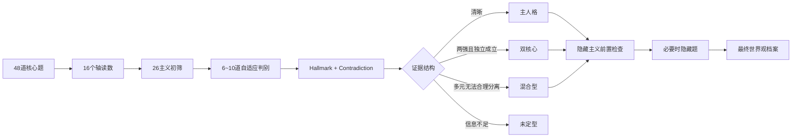

# AIdeology 测量与判别规范 v1.0

> **状态：产品正式冻结版**

基线来源：v0.1、v0.2 两轮 AI 角色压力测试。v1 不再围绕同一批模拟人格无限调参；从本版开始进入产品实现与真实用户阶段。

## 最终结构

- 26 个核心主义 + 8 个隐藏主义
- 15 条规范/扩展轴 + M1
- 48 道核心题
- 6~10 道自适应近邻题
- 必要时 0~4 道隐藏专题题
- 主人格、共鸣主义、双核心、混合型、低信息量均为合法结果

典型题量约 **54~60 题**。

## 为什么到 v1 停止模拟迭代

第二轮已经证明自适应结构可以修复部分系统性误判；继续围绕人为编写的“纯原型角色卡”优化，会逐渐变成识别角色卡，而不是真人世界观测量。

> **v1 宁可输出双核心、混合型或未定型，也不为了模拟 Top1 命中率强行分类。**

## 最终测试流程

## AxisFit：取消中间基线偏置

v0.2 中，靠近中间的原型天然对全中间用户获得较高匹配。v1 先扣除“全中间者”的天然相似度。

- `s(u,t)=1-|u-t|/2`
- `b(t)=s(0,t)`
- `advantage=s(u,t)-b(t)`

再做原型内归一。**所有轴都答中间时，26 个原型 AxisFit 都等于 50。**

## 自适应判别：非零和

一个答案可以同时支持两个主义，只是强度不同；也可以只反对一方而不支持另一方。每个选项直接保存 `evidence_a` 与 `evidence_b`，禁止用 A→E 字母位置做镜像判分。

## Hallmark

主人格必须出现真正核心信条：

- 至少 2 个独立证据源；
- score=0 的中间答案不能算 Hallmark；
- 高共识题不能单独形成 PASS；
- 必需自适应题未问到时最多 PARTIAL。

## 最终评分

`RawFit = 0.50×AxisFit + 0.30×DiscriminatorEvidence + 0.15×Hallmark + 0.05×Consistency`

反证：medium −10；strong −25。

- ≥70：强主人格
- 64~69：主人格候选
- 56~63：共鸣
- <56：通常不展示

## 双核心 / 混合 / 未定型

双核心：gap≤4、两者≥66、Hallmark均PASS，且核心证据不完全来自同一轴。

低信息量：中间答案率≥38%、平均绝对轴值<0.25、Top1−Top2<7。此时输出“你的 AI 世界观目前仍在形成中”。

## AI常态现实主义

作为元原型：只有 M1≤−0.40、M1三题至少2题明确常态、A22不反对、且其他25主义没有 FinalFit≥70 时才可成为主人格；否则只是 `AI常态倾向` 标签。

## 隐藏主义

必须满足明显前置轴 + 专题触发题；两道专题题均须明显支持且至少一道强支持。深未来主义最终前置 X3≥0.65，并要求核心 X3 至少两题有明确长期成本取向。

## v1 之后

不再运行第四、第五轮 AI 模拟调参。下一阶段是 OpenDesign → GitHub Pages → 匿名真实用户数据。样本足够后再做 EFA/CFA/聚类/IRT，届时发布 v1.1 或 v2。
